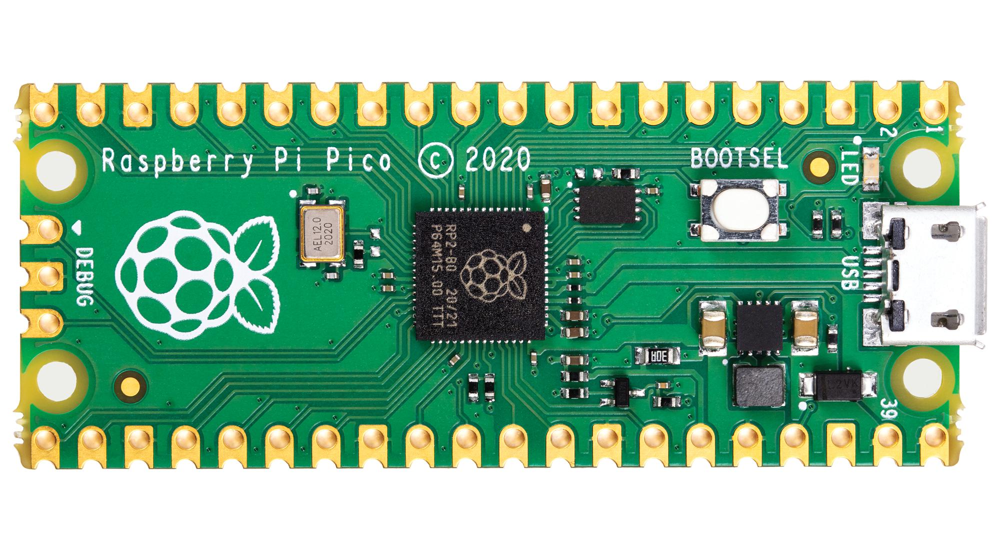

# Collar Design

## Basic Requirements

We want a small box that will be attached to the dog or cat collar. So

- It should be small and light as much as possible (weight <50g, should not be bigger than 80 · 30 · 20 mm)
- Long lasting battery (minimum >24 hours)
- Can alway connect to the internet (>95% of the battery time)
- Every sensors will be integrated into the box. (We need to build a custom PCB)
- Waterproof

## Sensor Specs

#### Heart Rate
From this [article](https://neurosky.com/2015/01/ecg-vs-ppg-for-heart-rate-monitoring-which-is-best/)
- PPG (photoplethysmography) sensor use a light-based technology to sense the rate of blood flow.
- ECG (electrocardiography) sensor measure the electric signal generated from the heart.

Maybe we can use both and determine which is more correct. 
(need more explanation, how to deal with dog/cat fur)

- Gravity Heart Rate Monitor Sensor (PPG)

#### GPS / LTE

(Which ISP to use?, what is the mode of connection?, how much data need to passed on this?)

SIM7080G NB-IoT / Cat-M / GNSS (This can also provide GPS)

#### Microphone

(Bitrate, Sampling rate?)

- High Sensitive Microphone Module
- Fermion: Voice Recorder Module 
- [Electro-magnetic microphone (MEM)](https://youtu.be/wQkrD2D-XFA?si=1bjIS1xrrbElS7r1)

Interesting Link
- https://academic.oup.com/cz/article/67/2/165/5892256
- https://www.lsu.edu/deafness/HearingRange.html
- https://www.ncbi.nlm.nih.gov/pmc/articles/PMC7000907/#:~:text=Cat%20vocalizes%20to%20communicate%20with,contains%20more%20types%20of%20vocalizations.
- https://www.quora.com/What-is-the-vocal-range-of-cats-by-frequency

#### Processor

Raspberry Pico could be our initial processor for the prototype. (why??)

[Brief Overview](https://datasheets.raspberrypi.com/pico/pico-product-brief.pdf), 
[Datasheet](https://datasheets.raspberrypi.com/pico/pico-datasheet.pdf)

#### Battery

(why lithium??)

2 YDL 3.7V 1000mAh 503450 Lipo Battery Rechargeable Lithium Polymer

## Software Requirements 
- Can use MQTT to send the data to the server every 5 minutes. (QOS 1, at least once)
- Trigger the microphone to record the sound when there's a sound that exceed the threshold
- Store the GPS data every 5 minutes.
- Store the heart rate data every 10 seconds.
- Can go in power save mode, when the pet is lost (only sending GPS data)
