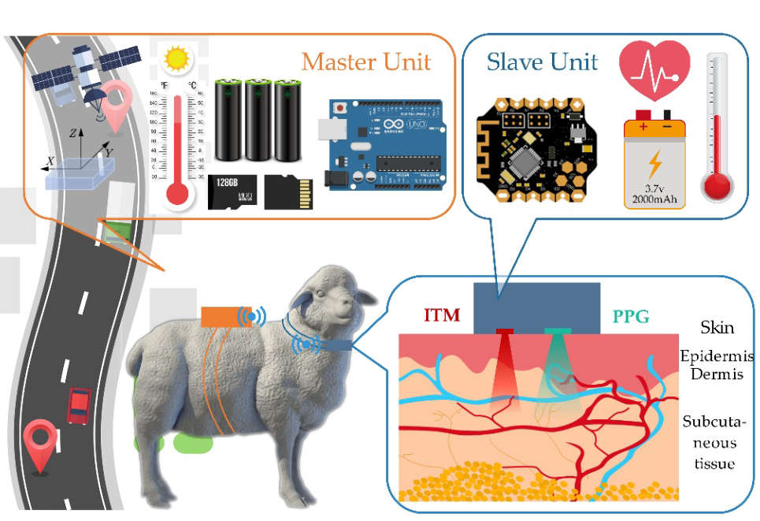
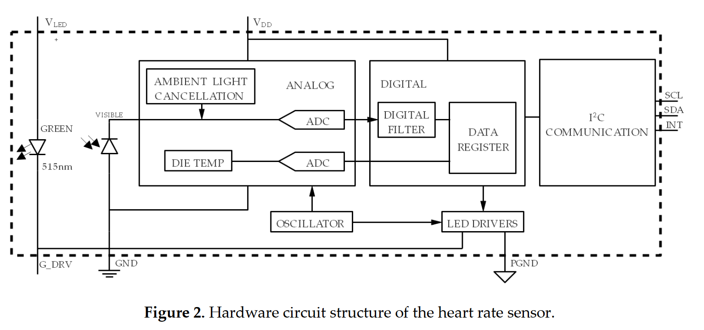

# Collar Design

## Basic Requirements

We want a small box that will be attached to the dog or cat collar. So

- It should be small and light as much as possible (weight <50g, should not be bigger than 80 · 30 · 20 mm)
- Long lasting battery (minimum >24 hours)
- Can alway connect to the internet (>95% of the battery time)
- Every sensors will be integrated into the box. (We need to build a custom PCB)
- Waterproof

## Sensor Specs

### Heart Rate
From this [Article | ECG vs PPG for heart rate monitoring](https://neurosky.com/2015/01/ecg-vs-ppg-for-heart-rate-monitoring-which-is-best/)
- **PPG (photoplethysmography) use a light-based technology to sense the rate of blood flow.**
- ECG (electrocardiography) measure the electric signal generated from the heart.

#### **Dealing with Dog and Cat fur**

**from this** [**Research | IoT for Living Sheep.**](https://www.researchgate.net/publication/332477439_WSMS_Wearable_Stress_Monitoring_System_based_on_IoT_Multi-Sensor_Platform_for_Living_Sheep_Transportation)

- For convenient wearing and high reliability PPG sensor type is better.
- They measure pulse and blood oxygen saturation by using sheep tissue to cause different light transmittance when the blood vessels beat.
- The heart rate sensor is composed of light source (they use green LED because the absorption characteristics of hemoglobin.) and photoelectric converter.
- They emitted green LED captured light signal then converted into an electrical signal, amplified, and outputted

> *Since this method works on animals like sheep, which have thick fur, as well as dogs and cats, it is an interesting method to use.* 

#### **Structure of PPG Heart Rate Sensor**

- LED Chip AM2520 (Green)
- Optical Receiver Chip APDS-9008
- Electrical Signal Amplifier

### GPS / LTE

(Which ISP to use?, what is the mode of connection?, how much data need to passed on this?)

SIM7080G NB-IoT / Cat-M / GNSS (This can also provide GPS)

### Microphone

(Bitrate, Sampling rate?)

- High Sensitive Microphone Module
- Fermion: Voice Recorder Module 
- [Electro-magnetic microphone (MEM)](https://youtu.be/wQkrD2D-XFA?si=1bjIS1xrrbElS7r1)

Interesting Link
- https://academic.oup.com/cz/article/67/2/165/5892256
- https://www.lsu.edu/deafness/HearingRange.html
- https://www.ncbi.nlm.nih.gov/pmc/articles/PMC7000907/#:~:text=Cat%20vocalizes%20to%20communicate%20with,contains%20more%20types%20of%20vocalizations.
- https://www.quora.com/What-is-the-vocal-range-of-cats-by-frequency

### Processor

Raspberry Pico could be our initial processor for the prototype. (why??)

[Brief Overview](https://datasheets.raspberrypi.com/pico/pico-product-brief.pdf), 
[Datasheet](https://datasheets.raspberrypi.com/pico/pico-datasheet.pdf)

### Battery

**Lithium Polymer (LiPo)** Battery type.

**Advantages**
- LiPo battery is flexible and can be manufactured in various shapes and size, This flexibility makes them suitable for applications where space is limited.
- High energy density meaning they can store more energy in a given volume or weight.

> *Since our collar must be small, lightweight and space is limited. From the advantages of LiPo batteries that can hold a lot of energy and can change shape Therefore it seems like a good option to use.*

**The battery model we are interested in**

- **YDL 3.7V 1000mAh 503450 Lipo Battery Rechargeable Lithium Polymer x 2**
    - Voltage: DC 3.7V; Capacity: 1000mAh
    - Material: Lithium Polymer; Net Weight: 22g
    - Size: 50 x 34 x 6mm / 1.97" x 1.34" x 0.24" (LWT)

- Power assumption
    > todo!()

> *This batteries can supply our collar's sensors for at least 24hrs.*

## Software Requirements 
- Can use MQTT to send the data to the server every 5 minutes. (QOS 1, at least once)
- Trigger the microphone to record the sound when there's a sound that exceed the threshold
- Store the GPS data every 5 minutes.
- Store the heart rate data every 10 seconds.
- Can go in power save mode, when the pet is lost (only sending GPS data)
