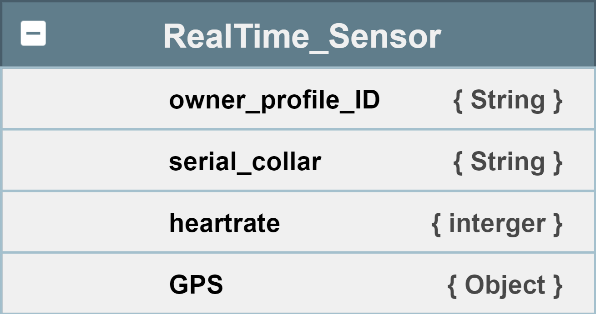

# Database Schema
We will divide the database design into two parts: SQL and NoSQL.
## SQL using PostgreSQL

## No SQL using MongoDB

### Entities
#### User_Owner
Entity for member login system data.
#### Community_Groups
Entity of all groups' data in the application, which includes group name, group purpose, and image path.
#### Post
Entity of all posts in the application, which includes message, image path, date, event name, event description, and location.
#### Post_Comment
Entity of all comment of post in the application, which includes message and, image path.
#### Post_Like
Entity of likes on all posts in the application, which includes reaction.
#### Profile_User
Entity of all users in the application, which includes full name, nickname, gender, phone number, and address.
#### Profile_Pet
Entity of all users' pets in the application, which includes name, birthdate, breed, gender, weight, color, diseases, vaccination status, neutering status, and pet type.
#### Vaccine_History
Entity of vaccination history for all pets in the application, which includes vaccine name and vaccination date.
#### Health_History
Entity of health history for all pets in the application, which includes text and date.
#### RealTime_Sensor
Entity of data received from all sensors in the application, which includes user ID, serial collar ID, heart rate, and GPS

### Relations
#### User_Community_Groups
For this relation, it means which group(s) the user belongs to.