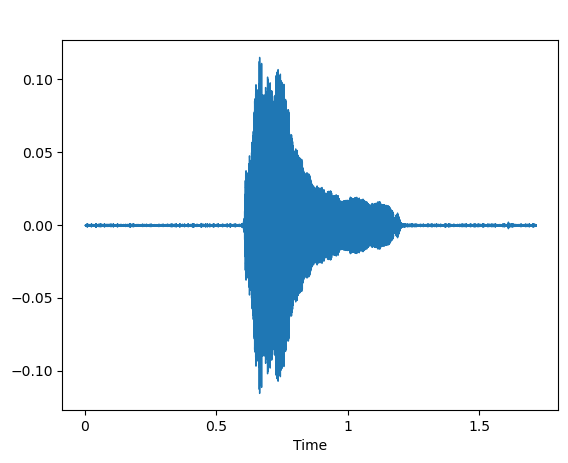
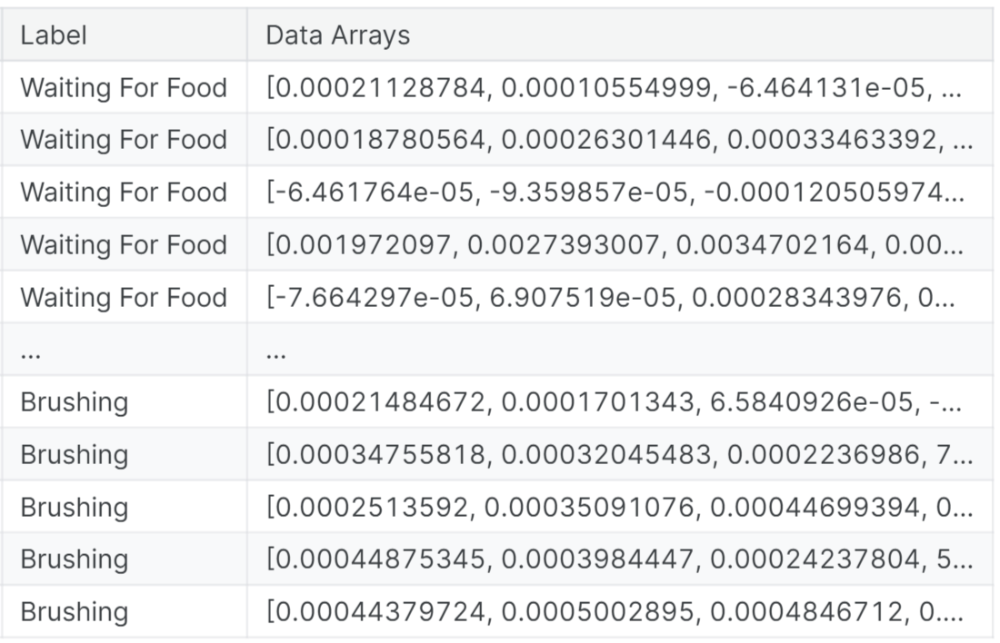

# MACHINE LEARNING DESIGN
Overview of  machine learning and training model frame work.

<!-- 

**Section**

- [ 
-  

 -->

## Data set

**kaggle.com** https://www.kaggle.com/code/gleblevankov/meow-meow

- For our project, we utilize a dataset sourced from Kaggle (kaggle.com). This dataset comprises 440 sound recordings capturing meows emitted by cats in diverse contexts. The recordings involve 21 cats from two breeds, Maine Coon and European Shorthair, responding to three distinct stimuli, which serve as labels for prediction: hungry, isolated, and happy.

**Cat sound**
 
 
- Example Sound of Hungry cat.
 

Sound wave hungry
 

  Mel frequency cepstrum coefficient

 
 

- Example Sound of Isolated cat.

Sound wave Isolated
 

  Mel frequency cepstrum Isolated

 

- Example Sound of Happy cat.

Sound wave Happy
 

  Mel frequency cepstrum Happy

 

**Features Extraction form Cat sound**

To effectively process audio data, we techniques by splitting the audio into short segments and computing frequency spectra for each segment. 
This process results in a sequence of frequency spectra, 
each representing a small slice of time. 
- By stacking these spectra together, we create a spectrogram, which visually displays the frequency content of the audio signal over time.

- Furthermore, we utilize methods like the Mel Frequency Cepstrum Coefficient (MFCC) to extract features from the audio. 
- MFCC involves the same process of splitting the audio into segments and computing frequency spectra. However, it specifically focuses on capturing the essential characteristics of the audio signal's frequency content as it changes over time. 
- By leveraging MFCC, we can effectively represent the audio data for classification tasks.
 
*

*
-  Mel frequency cepstrum 
-  Mel frequency cepstrum coefficient

**Features Extraction from Cat sound**
 

## Model Classification Architecture
 Considered as the backbone of Classification
 Our model's backbone for classification is the Convolutional Neural Network (CNN). CNNs are particularly effective for image and audio data due to their ability to automatically learn spatial hierarchies of features. 
- The input dimension for our model is 160x120, representing the MFCC coefficients. 
- The CNN architecture consists of convolutional layers for feature extraction, pooling layers for dimensionality reduction, and fully connected layers for classification. 
- The model comprises a total of 82,972,163 trainable parameters.

*
Convolutional Neural Network model
*
-  weight total 82,972,163 parameters
    - all parameter are trainable
    
**Training Process**
 
*

*
During the training process, the model learns to minimize a predefined loss function by adjusting its parameters 
 In our case, the model achieved an accuracy of 70.20% on the test data, with a loss of 1.0762.
- Accuracy of our model on test data :  70.20202279090881 %
 
 

*

*
A confusion matrix is a valuable tool for assessing the performance of a classification algorithm. It visualizes and provides a summary of true positive (TP), true negative (TN), false positive (FP), and false negative (FN) predictions.
 

- From the confusion matrix, various performance metrics can be calculated, including accuracy, precision, recall, and F1-score.
    - Accuracy = (TPs + TNs) / (TPs+TNs+FPs + FNs)
    - Precision = TPs / (TPs + FPs)
    - Recall = TPs/(TPs+FNs)
    - F1 = 2 x (Precision x Recall)/(Precision + Recall)
*

*
 