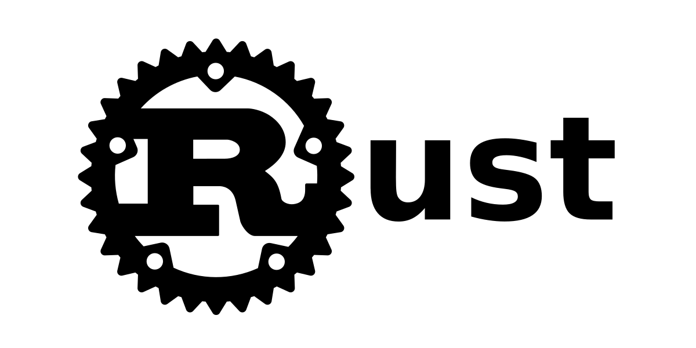

# Flutter (Front End)

> [Flutter](https://flutter.dev/) is an open source framework 
> by Google for building beautiful, natively compiled, multi-platform applications 
> from a single codebase. *From their website*

We choose Flutter as our framework to develop our mobile application because of
- Cross-Platform Consistency: we can build for both IOS and androin using the same code.
- Modular Architecture: widgets is very easy to work with.
- Expressive Code: the programming language Dart is simple, fast enough, static type, and 
has an interesting sound null safety.
- Extensive Plugin Ecosystem: the community is big, so we have a lot of other people's code to use.

# Rust (Both on Collar Software and Lambda)

> According to their website [Rust](https://www.rust-lang.org/) has good
> - **Performance**: Rust is blazingly fast and memory-efficient: with no runtime or *garbage collector*, 
> it can power performance-critical services, run on embedded devices, \
> and easily integrate with other languages.
> - **Reliability**: Rust’s rich type system and ownership model guarantee memory-safety and 
> thread-safety — enabling you to eliminate many classes of bugs at compile-time.
> - **Productivity**: Rust has great documentation, a friendly compiler with useful error messages, 
> and top-notch tooling — an integrated package manager and build tool, 
> smart multi-editor support with auto-completion and type inspections, an auto-formatter, and more.

We choose Rust as our main language for developing backend side code, because of 
- It's fast, memory safe, which are good for embeded devices.
- It's a joy to write, `cargo` is super easy to work with.
- Rust community is growing, and many big companies seems to want to adopt it 
(e.g. [Microsoft seeks Rust developers to rewrite core C# code](https://www.theregister.com/2024/01/31/microsoft_seeks_rust_developers/)).
- Rust's ownership model and fearless concurrency support make it well-suited 
for building scalable and concurrent backend systems.
